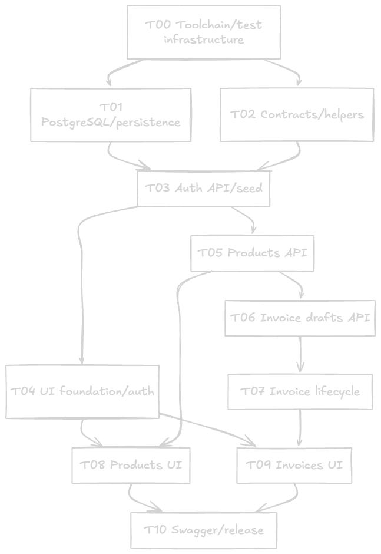

# StockFlow

Inventory and invoicing for a small distributor who currently oversells while tracking stock and
invoices in spreadsheets. Each staff account gets its own products and invoices: products carry a
stock level and a price, invoices are drafted with snapshotted line prices, and issuing, paying or
cancelling one moves stock atomically.

Built with Next.js 16 (App Router), TypeScript, Tailwind v4, Prisma 7 with PostgreSQL, BetterAuth
(bcryptjs password hashing) and Zod. The full specification is `implementation_plan.md`, the
requirement-to-evidence ledger is `docs/requirements.md`, and the task cards under `docs/tasks/`
record how the work was sequenced and verified.

## Running/Deployment

### Quick start (containers)

Needs Docker and a populated `.env`.

```bash
cp .env.example .env
node -e "console.log(require('node:crypto').randomBytes(32).toString('hex'))"   # paste into BETTER_AUTH_SECRET
docker compose up --build
```

The `app` service builds the production bundle, runs `prisma migrate deploy`, applies the idempotent
demo seed and serves on <http://localhost:3000>. Register your own account, or sign in with the demo
credentials below. Stop with `docker compose down`; add `-v` to drop the database volume too.

### Local development

```bash
pnpm install --frozen-lockfile
pnpm db:up        # PostgreSQL 17 on localhost:5432 (Compose service `postgres`)
pnpm db:migrate   # prisma migrate deploy
pnpm db:seed      # demo data; idempotent, never overwrites rows you changed
pnpm dev          # http://localhost:3000 — one process serves the pages and the API
```

`generated/prisma` is a build artifact and is not committed: `dev`, `build`, `typecheck` and both test
subsets generate the Prisma client on demand, so a clean checkout needs no manual generate step.

### Environment

`.env` is git-ignored; `.env.example` is tracked and contains local-only placeholders.

| Variable | Purpose | Local value |
|---|---|---|
| `DATABASE_URL` | Application connection string | `postgresql://stockflow:…@localhost:5432/stockflow` |
| `TEST_DATABASE_URL` | Isolated database for integration tests | `…@localhost:5433/stockflow_test` |
| `POSTGRES_USER` / `POSTGRES_PASSWORD` / `POSTGRES_DB` | Compose `postgres` service; keep in step with `DATABASE_URL` | `stockflow` / local-only / `stockflow` |
| `TEST_POSTGRES_PASSWORD` | Compose `postgres-test` service | local-only |
| `BETTER_AUTH_SECRET` | Session signing secret; a placeholder or a value under 32 characters is rejected at startup | generate your own |
| `BETTER_AUTH_URL` | Trusted origin **and** cookie host. Must match the origin and host string you actually open | `http://localhost:3000` |
| `TAX_RATE_BPS` | Default tax rate in basis points, `0`–`10000`; snapshotted on each new invoice | `1100` (11 %) |
| `NODE_ENV` | Standard Next.js mode | `development` |

### Demo credentials

| Email | Password |
|---|---|
| `demo@stockflow.local` | `StockFlowDemo!2026` |

The seed also creates five products (`DEMO-001` … `DEMO-005`) so invoice screens have something to
pick from. It only creates what is missing: edited prices, stock levels and soft deletions survive a
rerun. The seed refuses to run with `NODE_ENV=production`.

## Further Details

### API documentation

- **Specification (machine-readable):** `GET /api/openapi.json` — OpenAPI 3.1, built from the same
  Zod schemas the route handlers validate with, and served by the application itself.
- **Viewer (human-readable):** <http://localhost:3000/docs> — Swagger UI rendered from the locally
  installed `swagger-ui-dist` package. No CDN, no external validator and no session required.
- The viewer is **deliberately not linked from the client application**: the people who use StockFlow
  to bill customers are not the maintainers of its API, so no client screen advertises developer
  documentation. The URL is documented here instead.
- Automated coverage of the specification lives in `tests/unit/documentation.test.ts` (does the
  document validate, does it match the implemented handlers, statuses, error codes and security
  requirements, and does the client stay free of documentation links). Rendering the viewer is a
  manual reviewer-checklist item, because the project has no browser test suite by design.

### Tests

```bash
pnpm test             # both suites
pnpm test unit        # no database: money/validation/env/http/harness/documentation
pnpm test integration # real PostgreSQL, resets the isolated test database first
pnpm lint             # eslint
pnpm typecheck        # prisma generate && next typegen && tsc --noEmit
pnpm build            # prisma generate && next build
```

The runner pins `DATABASE_URL`, `TEST_DATABASE_URL`, `BETTER_AUTH_SECRET`, `BETTER_AUTH_URL`,
`TAX_RATE_BPS` and `NODE_ENV` for DB-backed children, refuses to run integration tests against the
development database, and does not tear the shared Compose services down. There is no browser suite:
UI behaviour is verified with the manual checklist in the task cards, and API behaviour with the
real-PostgreSQL integration suites.

### Behaviour worth knowing (From the project specification or inferred)

- **Money** is integer cents everywhere, displayed as USD. There is no currency selection, and the
  API rejects client-computed prices or totals: `TAX_RATE_BPS` is snapshotted on each invoice and tax
  is rounded half-up exactly once.
- **Drafts** validate stock but never reserve it. Issuing deducts every line in one transaction (or
  none), and cancelling an issued invoice restores the stock exactly once. `PAID` and `CANCELLED` are
  terminal, so an illegal or repeated transition answers `409` without repeating a stock effect.
- **Snapshots:** a line stores the product name and unit price from when it was first added, so later
  product edits never rewrite an invoice. Soft-deleting a product keeps its SKU reserved and keeps
  existing invoices intact.
- **Ownership:** every read and write is scoped to the session's user. Another user's identifier
  answers `404` exactly like an unknown one, and request bodies never carry ownership.
- **Origin:** mutating requests must send an exact `Origin` header matching `BETTER_AUTH_URL`.
  Command-line clients need `-H 'Origin: http://localhost:3000'` plus the session cookie.
- **Concurrency:** products and invoices carry a `version`; writes are rejected with `409` when the
  value you read is stale, and every stock change increments the product version.

## Tech choices

Keeping in mind the goal of this take home, and that is to demonstrate skills required to be able to jump right in to a development team and easily pick up a project and colaborate with peers, I chose the following 

- **Next.js** I chose this since this is what was posted on the job description. I figured it fitting for both demonstration and fulfilling spec requirements/

- **Prisma 7 + PostgreSQL** I chose this since I am most comfortable with this type of workflow.

- **Zod schemas shared by routes and forms.** Same as the above, zod just makes it easier to keep track.

- **BetterAuth with bcryptjs (cost 12)** I chose BetterAuth, compared to the standard NextAuth as I believe BetterAuth to be more mature and aligned with industry standard. It also integrates Ok with bcryptjs.

- **Swagger UI, from the installed package** So the documentation surface works offline, also easy to hand off to agents to do.

- **Hybrid TDD, backend with full TDD, and frontend with semi-manual verification** I figured this was the industry standard on how AI pair programming was conducted and I wanted to implement such within this repo. I also made sure to make a dependency graph so that I could leverage parallel agents to implement features faster if the features weren't dependent on each other.

> 

This way, I also had a clear structure and goal that I could work towards with clear deliverables.

The above choices aside, I felt it was also prudent to mention my shortcomings in hindsight.
1. I felt the planning phase went well at first, but when I got into the project, it definitely ballooned into something much bigger than anticipated. As such, I feel like I didn't design the scope well enough for this project. Since this is a small project, the scope should have been kept smaller to fit with the theme and allow more hands on programming to demonstrate my coding skills. What ended up happening was that there were a lot of tests (which is not bad per se, just not fitting for this project) and each task became more agentic + code reviewer than I'd hoped for.
2. I didn't leverage MCPs and Skills as much as I'd liked. Since not having much experience working with cursor-like workflows, I spent quite a bit of time tinkering here and there to get a decent setup which cost me a lot of time. I should have spent more time during the planning phase to set up skills and MCP servers so that the agents could have an easier time getting to the goal.

## With another week

- I would have liked to polish the workflow better and set up better skills and mcps, as well as plan the implementation details more and define the scope more heavily.
- I feel like I rushed reviewing a lot of goals to hit the deliverable deadline and would like to take more time to understand the code better. But as it is, I have spent almost every waking hour since 1am WIB tinkering on this.
- Probably implement playwright into the TDD since I ditched it midway through implementation. I figured it would take too long to get right with current constraints. I would also like to go through the app more and bug test the frontend since I didn't get much time to do that

## AI usage

The work was done with an AI assistant (Cline) driving implementation behind a task-card workflow
that a human reviewed and accepted:

- The specification in `implementation_plan.md`, the dependency graph in `docs/execution/` and the
  task cards in `docs/tasks/` were written first; each task was then implemented on its own branch in
  an isolated worktree, test-first, with the evidence recorded on its card.
- Every claim on those cards is a command plus a revision (`pnpm test unit`, `pnpm test integration`,
  `lint`/`typecheck`/`build`, HTTP checks) rather than a summary. Where a check could not be run — the
  browser phase, which was removed on purpose — the cards say so instead of implying coverage.
- The AI wrote application code, tests and documentation; the human set the scope, reviewed, fixed, and implemented the code, answered
  specification questions and design choices, and verified the UI in a browser before accepting each task (depending on task).
- Known limits were handled explicitly: generated code was reviewed against the plan, no requirement
  ID or time budget was invented, and a failing check was reported as failing rather than tuned away.

## Time taken

Approx. 16 hrs with short breaks in between to eat and such.

## Repository layout

```
app/            App Router pages, the (auth) and (dashboard) shells, and the API route handlers
components/     Client components and the shadcn-style UI primitives
lib/            Auth, HTTP/error mapping, money, validation schemas, services, the OpenAPI document
prisma/         Schema, migrations and the idempotent demo seed
tests/          unit/ (no database) and integration/ (real PostgreSQL) suites plus the harness
scripts/        test runner that pins the environment and guards the test database
docs/           task cards, execution graph, requirement ledger
docker/         container entrypoint (migrate, seed, serve)
```

## Troubleshooting

- `pnpm test integration` needs the Compose `test` profile up (`docker compose --profile test up -d
  postgres-test`) and the shared test database free; it refuses to run against the development
  database by design.

