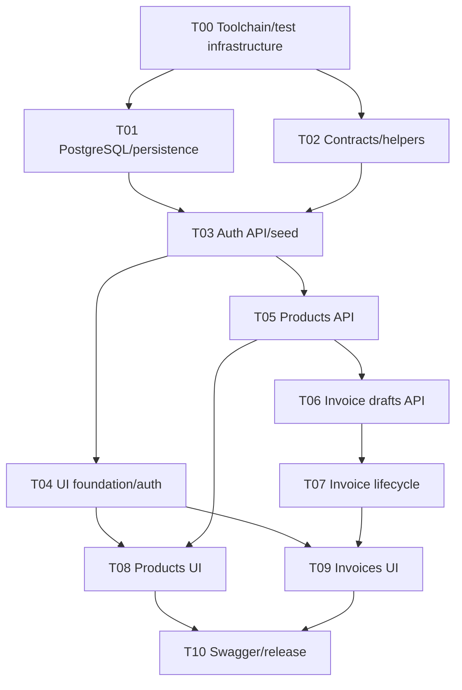

# StockFlow execution dependencies

Canonical graph: `/home/areion/projects/eterna-take-home/docs/execution/dependency-graph.json`. Business specification: `/home/areion/projects/eterna-take-home/implementation_plan.md`. Graph IDs/dependencies/ownership govern scheduling; cards govern acceptance/evidence. Reconcile disagreements before coding. Rebase documented absolute workspace prefixes onto the assigned worktree; never edit another checkout.

T00–T06 are accepted, merged and coordinator-verified — per-task approved tips and tested merge SHAs live in the graph's `acceptance_records` (T03: task tip `bcad7789fead68f035d478815efce380b012f036`, tested merge `3e38219630b8d4ff7f1ef151eec85c87820dabd8`; T04: task tip `e22cefc60d366f5624e5524396f8bedf9c0ac56b`, tested code `f9f3bb93`, tested merge `e30b19499bb368a999428df143291014e5124fc8`; T05: task tip `d5eeaf37d317d386e884bfbf634b7b1fc74fb96d`, tested implementation `51ff472`, tested merge `6d05f4ceb685536f77c4f92352b847466028daed`; T06: task tip `8c1a8d305105d9ec6ccc7ef6c5f385cad612285f`, tested code `898c21908a52fd12995196b60206996c11650f45`, tested merge `f2960930eed5e2a97dbf09af10c1a07a00a0dea2`). The graph acceptance record supersedes historical REVIEW/Pending handoffs. Verify merge ancestry on fetched origin/main before dispatch. T06 (invoice drafts) is accepted and merged, so T07 (invoice lifecycle) is now eligible behind it; T08 (products UI) has an in-progress worker branch on origin, while T09 still waits on T07 and T10 on T08/T09. AMEND-T04-1 removed the Playwright layer and retired the `next-e2e` lease, so UI evidence is the reviewer checklist on the owning card; the shared `postgres-test` lease and a leased `next dev` port still serialize shared resources. Docker is available (this session required `sg docker -c`).

**AMEND-T04-1 (user, 2026-09-18, recorded on `task/T04-ui-foundation`):** Playwright and its browser layer were removed from the application — `playwright.config.ts`, the `@playwright/test` dependency, the `test:e2e` script, the runner's `e2e` subset, the port-3100 lease and every `tests/e2e/**` file (T04/T08/T09/T10). No browser phase exists in this guide's commands any more. **UI work is therefore not test-driven:** F1–F6 are verified by the manual reviewer checklist published on the T04 card, extended by T08 (products rows) and T09 (invoice rows) and recorded per requirement ID by T10; automated coverage stays on unit tests, the real-PostgreSQL integration suites and lint/typecheck/build. The same decision authorizes T04 — and, where necessary, T08/T09 — to add a deliberately simple `Dockerfile`, a `.dockerignore` and an `app` service in `docker-compose.yml`, pinning the `mise.toml` versions (Node 24.21.0, pnpm 12.4.2) so a fresh clone needs only a populated `.env` before `docker compose up` yields a migrated and seeded app.

## Dependency DAG

An edge requires accepted, merged code with recorded main revision, not merely a branch push. Requirement IDs denote contributed coverage; one task need not fully satisfy each mapped ID. A6/A7/N6 are verified per API family; F1–F6 are verified by the reviewer checklist on the owning card (no browser suite exists after AMEND-T04-1); T10 audits all 36 IDs against actual tests and checklist results.

## Agent-owned worktree lifecycle

Workers do not edit primary-checkout project files or install/test/build there. Coordinator publishes `/.worktrees/` ignore rule with this baseline before T00. Each exclusively assigned agent creates `<PRIMARY>/.worktrees/<task-id>-<slug>` on `task/<task-id>-<slug>` from verified origin/main; PRIMARY is the coordinator-confirmed absolute checkout, not a resumed linked worktree. Rebase all canonical paths to the feature worktree and explicitly set every command's cwd there. Local dependencies/builds/env are not copied or symlinked from another checkout.

The skill owns detailed creation/resumption/cleanup gates. Path/branch collision or uncertain ownership -> pause; no alternate duplicate worktree. Agents commit, integrate main, revalidate, push their branch and verify remote HEAD. After durable REVIEW handoff and clean-state/ignored-artifact/process checks, each agent removes only its own worktree with non-forced `git worktree remove`. Keep feature branches for review. Report removal in chat/PR, not primary files. On blockers/conflicts/failed push or valuable local artifacts, preserve the worktree and report restart path/HEAD. Never force removal, prune others' worktrees, or resolve shared Git locks yourself. Git administration and database/port resources are still shared.

## Scheduling and file/resource ownership

- Sequential order: T00, T01, T02, T03, T04, T05, T06, T07, T08, T09, T10.
- Source-edit parallelism: T01/T02; after T03, T04/T05; after T04+T05, T08 alongside T06 then T07; after T07, T08/T09 if still pending.
- Parallel worktrees do not isolate databases. Coordinator grants one postgres-test lease for localhost:5433/stockflow_test; the former next-e2e lease for port 3100 was retired with the Playwright layer (AMEND-T04-1). Record owner/worktree/acquisition in assignment channel. No lease -> wait; stale/unknown holder -> ask, never kill/reset its processes.
- T06 -> T07 deliberately serializes `/home/areion/projects/eterna-take-home/lib/services/invoices.ts`. Other unordered tasks have disjoint source ownership. /** denotes a subtree; [id] is a literal Next segment, not a glob.
- T00 installs all approved dependencies including the UI primitives selected in the plan. T04 writes the shadcn-style components against that installed set (no CLI generation) and, under AMEND-T04-1, removes the Playwright dependency/accompanying scripts and adds the authorized container files (`Dockerfile`, `.dockerignore`, the compose `app` service). Any other dependency or manifest change is a BLOCKED coordinator request, not a silent edit.
- T01 owns Prisma-backed transaction helper, implemented without T02 imports: retry exhaustion rethrows a recognized Prisma error for T02 error mapper to map to 409. T02 DTOs/status unions avoid generated Prisma imports. T03 checks compatibility at the join.
- T00 harness owns schema-independent request/reset helpers and safety tests. T03 owns auth-backed tests/helpers.ts. T01 verifies migration, T03 seed. Do not create fake exported implementations to make foundation checks pass.
- T04 verifies auth/client behavior through unit tests, the merged integration suites and the container rehearsal; the rendered auth UI is checked with the reviewer checklist on its card, and concrete protected-page checks belong to T08/T09 (which extend the same checklist). No temporary product/invoice pages in T04.
- Workers edit only their own card and graph-owned files. Graph/skill/plan/AGENTS/memory bank are coordinator-only. Shared-contract fixes require pause, coordinated prerequisite amendment and affected-task revalidation. Ownership does not expire into unrestricted editing.
- Reviewer/coordinator serializes main merges and central status updates. Conflict-free text merges do not prove compatibility; zero conflicts cannot be guaranteed.

## Status and evidence

TODO -> READY -> IN_PROGRESS -> REVIEW -> DONE; blockers use BLOCKED. An explicit user dispatch such as "please work on T001" uniquely resolves to T01 and supplies assignment/coding/task-branch push authorization unless another active owner conflicts. No separate READY commit is required. Worker records IN_PROGRESS/REVIEW/BLOCKED only in its card; coordinator acceptance plus verified merged code establishes DONE centrally. Historical REVIEW/Pending text does not block successors and must not trigger another commit on the approved branch. Check approved-SHA ancestry on fetched origin/main and coordinator verification evidence. DB/port leases remain explicit. Skill sections 1 and 7 govern qualification and coordinator merge/push with branch retention.

Deliverable states: NOT_STARTED, IN_PROGRESS, VERIFIED, BLOCKED. VERIFIED requires file/test evidence at a named revision. Before/after upstream sync record commands/exit codes/tested implementation SHA. A final docs-only evidence commit may cite its tested parent; do not try to embed its own hash. Final chat records pushed HEAD. Later code changes invalidate earlier green claims until rerun. Keep API-contract notes in cards for T10.

## Dispatch and handoff

Prompt: "Implement assigned T05 using `/home/areion/projects/eterna-take-home/.cline/skills/implement-task-card/SKILL.md`. Coding and task-branch push are authorized; main merge is not. Dependencies are accepted at supplied revisions. Work only on owned files/card. Stop for conflicts/blockers; hand off in REVIEW."

Cline supports /implement-task-card when enabled; other agents explicitly read SKILL.md. Supply task/owner, verified absolute PRIMARY checkout and exclusive task slug, dependency revisions, test leases and reviewer; the agent creates/removes its own worktree using the skill. Resume the verified existing task branch after interruption, never duplicate/reset it blindly. Independent review checks spec/card, tests, ownership, auth/stock/money and actual diff. On blockers report command/error/Git state/conflicting files/decision needed. No automatic resolve/abort/reset/rebase/stash/force-push. Successors start only after coordinator accepts and merges.
